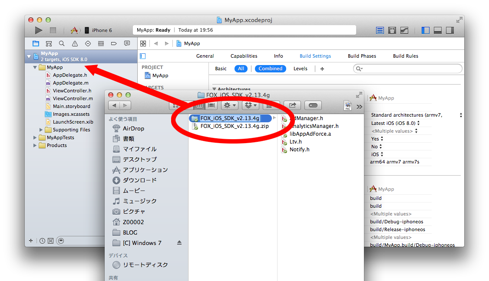

# Force Operation X是什麼

Force Operation X (下面簡稱F.O.X)是基於智慧手機的，用來最大改善廣告效果的綜合解決方案平台。除了對APP下載量和網絡用戶操作的基本計測外，還能基於手機用戶行為特性採用獨自效果計測基準，實現了企業宣傳推廣时費用与效果比的最大改善。

在這個文檔裡，詳細講解了基於智慧手機平台優化廣告效果的F.O.X SDK的導入步驟。

## F.O.X SDK是什麼

在APP中導入FOX，可以實現如下功能。

* **Install計測**

能夠按不同的廣告流入來計測安裝數。

* **LTV計測**

按不同的廣告流入来計測Life Time Value。作為主要的成果地點，有會員登錄，教程突破，消费等。能夠按照不同廣告来監測登錄率，消費率和消費額等。

* **流量分析**

自然流入和廣告流入的APP安裝數比較。能夠計測APP的啟動數，唯一用戶數(DAU/MAU)，持續率等。

# 1.	概要

本文檔說明了針對Force Operation X SDK Cocos2d-js插件的導入步驟。Force Operation X SDK Cocos2d-js插件適用於iOS和Android。

使用Force Operation X SDK能夠進行Install計測和LTV計測，流量分析。

在安裝完SDK以後，請確認APP的動作和效果測定結果裡沒有問題以後再向Market提出申請。有關效果測定的測試步驟，Force Operation X管理員會來聯繫。

## 1.1 SDK式樣

在APP中導入F.O.X，可以實現如下功能。

|處理|必須|概要|
|:------:|:------:|:------|
|Install計測|必須|啟動時，透過瀏覽器的啟動、Cookie計測手法，進行廣告效果測量。能夠測量啟動數、CVR等等。Method名稱：sendConversion|
|LTV計測|任意|在任意的成果地點進行成果通知，進行廣告別的消費數和入會員數測量。能夠測量消費金額、退出會員數等等。Method名稱：sendLtv|
|流量分析|任意|計測APP啟動和從Background恢復時的啟動。能夠啟動啟動數、活躍用戶數(DAU)、持續率。Method名稱：sendStartSession|

> Force Operation X SDK Cocos2d-js plugin是為了連接Native版本的SDK而做的wrapper，所以為了正確的導入SDK，需要iOS或Android的Native版本的SDK

#2.	iOS用Xcode項目的設定

##2.1	SDK的展開

將下載的SDK「FOX_Cocos2djs_SDK_&lt;version&gt;.zip」在OS上展開。被打包在Classes文件夾裡的文件如下。

文件名|必須|概要
:--------|:-------------:|:--------:
jsb_Cocos2dxFox_auto.cpp|必須|實現從JavaScript到使用C++的jsb文件
jsb_Cocos2dxFox_auto.hpp|必須|實現從JavaScript到使用C++的jsb文件
Cocos2dxFox.h|必須|頭文件。為從Cocos2d-x使用SDK做的封裝
Cocos2dxFox.mm|	iOS専用	|類庫文件。在iOS環境為從Cocos2d-x使用FOX SDK做的封裝
Cocos2dxFox.cpp|Android専用|類庫文件。在Android環境為從Cocos2d-x使用FOX SDK做的封裝
FoxVersionPlugin.h|任意|類庫文件。為從Cocos2d-x控制BundleVersion做的封裝
FoxVersionDelegate.m|任意|類庫文件。為從Cocos2d-x控制BundleVersion做的封裝|
FoxVersionPlugin.h|任意|類庫文件。為從Cocos2d-x控制BundleVersion做的封裝|
FoxVersionPlugin.m|任意|類庫文件。為從Cocos2d-x控制BundleVersion做的封裝|
FoxReengagePlugin.h|必須|頭文件。為從Cocos2d-x進行經由URL Scheme的啟動計測做的封裝(※1)|
FoxReengagePlugin.m|必須|類庫文件。為從Cocos2d-x進行經由URL Scheme的啟動計測做的封裝(※1)|

上面的文件是封裝文件，須和Native SDK結合起來進行安裝。

以下文件群是iOS的Native SDK，被一同包裝在「FOX_iOS_SDK_&lt;version&gt;」文件夾裡。

文件名|必須|概要
:--------|:-------------:|:--------:
AdManager.h|必須|頭文件。進行廣告的效果測定。|
libAppAdForce.a|必須|類庫文件。進行廣告的效果測定。|
Ltv.h|任意|頭文件。進行LTV計測。|
AnalyticsManager.h|任意|頭文件。進行流量分析。|

※如果「FOX_iOS\_SDK_&lt;version&gt;」文件夾沒有包含在「FOX_Cocos2djs\_SDK_&lt;version&gt;.zip」裡
請從SDK下載網站下載FOX_iOS_SDK_&lt;version&gt;.zip來使用。

##2.2 類庫的導入

* Xcode的菜單「File」→選擇「Add Files to “XXX”」
* 請導入Cocos2dxFox.h、Cocos2dxFox.mm。Cocos2dxFox.cpp是Android用的類庫文件，所以不需要追加。
* 如果使用BundleVersion判定功能，請導入FoxVersionDelegate.h、FoxVersionDelegate .mm和FoxVersionPlugin.h、FoxVersionPlugin.mm這4個文件。
* 如果是支持iOS9或者進行Reengagement計測時，請裝入FoxReengagePlugin.hとFoxReengagePlugin.m兩個文件。
* 選中「Copy items into destination group’s folder」

[類庫導入的詳細](./doc/integration/README.md)

##2.3 導入到Cocos2d-js項目的Classes
* 將jsb_Cocos2dxFox_auto.cpp和jsb_Cocos2dxFox_auto.hpp複製到project之下的Classes裡 
  （和Android項目通用）

##2.4 Framework設定

請把下面的Framework追加到開發項目裡。

<table>
<tr><th>Framework名</th><th>Status</th></tr>
<tr><td>AdSupport.framework</td><td>Optional</td></tr>
<tr><td>iAd.framework </td><td>Required</td></tr>
<tr><td>Security.framework </td><td>Required </td></tr>
<tr><td>StoreKit.framework </td><td>Required </td></tr>
<tr><td>SystemConfiguration.framework </td><td>Required </td></tr>
</table>

[Framework設定的詳細](./doc/config_framework/README.md)

##2.5 SDK的設定

在plist裡追加必要的設定讓SDK發揮作用。新建「AppAdForce.plist」這樣一個Property List文件放到項目的任意一個地方，並輸入下面的Key和Value。

<table>
<tr>
  <th>Key</th>
  <th>Type</th>
  <th>Value</th>
</tr>
<tr>
  <td>APP_ID</td>
  <td>String</td>
  <td>請輸入Force Operation X管理員告知的值。</td>
</tr>
<tr>
  <td>SERVER_URL</td>
  <td>String</td>
  <td>請輸入Force Operation X管理員告知的值。</td>
</tr>
<tr>
  <td>APP_SALT</td>
  <td>String</td>
  <td>請輸入Force Operation X管理員告知的值。</td>
</tr>
<tr>
  <td>APP_OPTIONS</td>
  <td>String</td>
  <td>請空白。</td>
</tr>
<tr>
  <td>CONVERSION_MODE</td>
  <td>String</td>
  <td>1</td>
</tr>
<tr>
  <td>ANALYTICS_APP_KEY</td>
  <td>String</td>
  <td>請將由Force Operation X管理者通知的數值輸入。 不利用流量分析的場合沒有必要設定</td>
</tr>
</table>

[SDK設定的詳細](./doc/config_plist/README.md)

[AppAdForce.plist例子](./doc/config_plist/AppAdForce.plist)

#3.	Android用項目的設定
##3.1	SDK的展開

將下載的SDK「FOX_Cocos2djs_SDK_&lt;version&gt;.zip」在OS上展開。 並將同樣包在「FOX_Android_SDK_&lt;version&gt;」文件夾裡的「AppAdForce.jar」導入到開發環境。接下來說明針對Eclipse project的導入步驟。

|文件名|必須|概要|
|:------:|:------:|:------|
|AppAdForce.jar|必須|Android的Native SDK。能夠計測通常成果・LTV成果・流量分析。|

※如果「FOX_Cocos2djs_SDK_&lt;version&gt;.zip」裡不包含「FOX_Android_SDK_&lt;version&gt;」文件夾，請從SDK下載頁面下載FOX_Android_SDK_&lt;version&gt;.zip後使用。

##3.2	導入到項目

展開下載的SDK「FOX_Android_SDK_&lt;version&gt;.zip」，請把「AppAdForce.jar」導入到APP的項目裡。

[Eclipse項目的導入方法](./doc/integration/eclipse/)
[AndroidStudio項目的導入方法](./doc/integration/android_studio/)

##3.3 AndroidManifest.xml的編輯
###3.3.1 permission的設定

為讓Force Operation X SDK執行，請在&lt;Manifest&gt;tag內添加如下permission設定。
	<uses-permission android:name="android.permission.INTERNET" />
	<uses-permission android:name="android.permission.ACCESS_NETWORK_STATE" />

###3.3.2 meta-data的設定
|參數名|必須|概要|
|:------|:------|:------|
|APPADFORCE_APP_ID|必須|請輸入Force Operation X管理員告知的值。|
|APPADFORCE_SERVER_URL|必須|請輸入Force Operation X管理員告知的值。|
|APPADFORCE_CRYPTO_SALT|必須|請輸入Force Operation X管理員告知的值。|
|ANALYTICS_APP_KEY|必須|請輸入Force Operation X管理員告知的值。|
|APPADFORCE_ID_DIR|任意|使用內(外)部存儲時，能夠指定任意的保存目錄名。 沒有指定的時候，會用PACKAGE名生成目錄。|
|APPADFORCE_ID_FILE|任意|使用內(外)部存儲時，能夠指定任意的保存識別子文件名。 沒有指定的時候，會用”__FOX_XUNIQ__”生成文件。|
|APPADFORCE_USE_EXTERNAL_STORAGE|任意|設定為0的時候，不會保存在內(外)部存儲裡。|

為讓Force Operation X SDK執行，請在&lt;application&gt;tag內添加必要的信息。

	<meta-data android:name="APPADFORCE_APP_ID" android:value="1" />
	<meta-data android:name="APPADFORCE_SERVER_URL" android:value="012345ABC" />
	<meta-data android:name="APPADFORCE_CRYPTO_SALT" android:value="abcdef123" />
	<meta-data android:name="ANALYTICS_APP_KEY" android:value="xxxxxx" />

###3.3.3 Install referrer計測的設定
將Install referrer計測所需要的設定添加在&lt;application&gt;tag內。

	<receiver android:name="jp.appAdForce.android.InstallReceiver" android:exported="true">
		<intent-filter>
			<action android:name="com.android.vending.INSTALL_REFERRER" />
		</intent-filter>
	</receiver>

如果"com.android.vending.INSTALL_REFERRER"的receiver class已經被定義，請參照[讓多個INSTALL_REFERRER R seceiver共存的設定](/lang/zh-tw/doc/integration/android/install_referrer/README.md)

###3.3.4 與AndroidManifest.xml相關的其他設定
* [URLScheme的設定](./doc/config_url_scheme/)
* [（任意）導入Google Play Services SDK來使用廣告ID](./doc/google_play_services/)
* [（任意）利用外部存儲設定重複排除](./doc/external_storage)
* [AndroidManifest.xml的設定範例](./doc/config_androidManifest/AndroidManifest.xml)

##3.4 導入到Cocos2d-js項目的Classes

展開「FOX_Cocos2djs_SDK_<version>.zip」、進行如下操作。

* 拷貝Android/Classes下面的Cocos2dxFox.h和Cocos2dxFox.cpp到項目下的Classes。
* 拷貝Android/Classes下面的jsb_Cocos2dxFox_auto.cpp和jsb_Cocos2dxFox_auto.hpp到項目下的Classes。
* 添加Cocos2dxFox.cpp和jsb_Cocos2dxFox_auto.cpp到項目下的jni/Android.mk、包含在Build對象內 
　→ 在LOCAL_SRC_FILES裡面添加Classes/Cocos2dxFox.cpp和Classes/jsb_Cocos2dxFox_auto.cpp的指定。

把Cocos2dxFox.cpp的JniHelper.h的include路徑調整到開発環境（下面是這個例子）

	#include <iostrem>
	#inclued “cocos2d.h”
	#include “Cocos2dxFox.h”
	#include “../android/jni/JniHelper.h”

#4 Install計測的安裝

## iOS・Android共通設定

為了把F.O.X插件登錄到Cocos2d-x，編輯AppDelegate.cpp。
首先，像下面那樣包含頭文件。

	#include "jsb_Cocos2dxFox_auto.hpp"

然後、請在AppDelegate::applicationDidFinishLaunching()方法裡的sc->start();之前書寫下面的代碼。

	sc->addRegisterCallback(register_all_jsb_Cocos2dxFox_auto);
	sc->start();

##4.1 Install的計測

導入初次啟動的Install計測，就能夠監測廣告效果。初次啟動時，啟動瀏覽器，對照在點擊廣告時所被賦予的Cookie資訊，進行成果計測。

在初次啟動時為了啟動瀏覽器，`AppDelegate:applicationDidFinishLaunching:` method等，追加效果測定用的處理到APP啟動時一定會被喚出的地方。

包含頭文件

	#include "Cocos2dxFox.h"

在JavaScript裡追加成果通知Code

	FoxPlugin::sendConversion(“default”);

在sendConversion方法的參數裡，通常請完全按上面那樣指定"default"這個字符串。

* [sendConversion的詳細](./doc/send_conversion)

為了計測經由URLScheme的啟動，請在設定了URLScheme的所有Activity的onResume()裡，安裝sendConversionWithUrlScheme方法。

導入Class

	import jp.appAdForce.android.cocos2dx.Cocos2dxAdManager;

APP啟動時的啟動計測（MainActivity類的安裝範例）

	public class MainActivity extends Cocos2dxActivity {

		@Override
		protected void onResume() {
			super.onResume();
			Cocos2dxAdManager.sendConversionWithUrlScheme(this);
		}
	}

如果靠URLScheme啟動的Activity的launchMode是"singleTask"或者"singleInstance"，為了經由URLScheme來接收參數，重寫onNewIntent方法，請按下面那樣來調用setIntent方法。

	@Override
	protected void onNewIntent(Intent intent) {
    	super.onNewIntent(intent);
	    setIntent(intent);
	}

#5 LTV計測的安裝

透過LTV計測，能夠計測廣告流入別的消費金額和加入會員數等。為了計測，須在任意地點添加进行LTV成果通信的代码。

在成果到達後執行的程式中加入SDK的處理程式。譬如說，會員登錄和APP內消費後的消費計測，是將LTV計測處理記述在登錄、消費處理實行後的回調方法內。

如果成果發生在APP內部，請如同以下記述在成果處理裡面。
在JavaScript裡書寫LTV成果計測代碼。

	cc.FoxPlugin.sendLtv(成果地点ID);

> 成果地點ID(必須)：請輸入由管理員所告知的數值。

* [sendLtvConversion的詳細](./doc/send_ltv_conversion)

#6 流量分析的安裝

導入流量分析，能夠計測自然流入和廣告流入的安裝數，APP的啟動數，唯一用戶數(DAU/MAU)，持續率等。流量分析會在APP啟動、或從後台恢復時，追加進行Session計測的代碼。如果不做流量分析，可以省略本項目的安裝。

####iPhone 項目
iPhone需要進行以下設定。

按照下面那樣添加在APP啟動地點AppDelegate.cpp的applicationDidFinishLaunching和applicationWillEnterForeground。

	FoxPlugin::sendStartSession();

####Android 項目
Android需要進行如下設定。

為了計測APP的啟動和從後台的恢復，追加代碼到Activity的onResume()方法。

導入Class

	import jp.appAdForce.android.AnalyticsManager;

APP啟動時的啟動計測（對於MainActivity class的安裝範例）。

	public class MainActivity extends Activity {

		@Override
		protected void onResume() {
				super.onResume();
			AnalyticsManager.sendStartSession(this);
		}
	}

＜如果在Java的Activity上，不能使用onResume()＞

按照下面那樣添加在APP啟動地點AppDelegate.cpp的applicationDidFinishLaunching和applicationWillEnterForeground裡。

	#include “Cocos2dxFox.h”

---

	FoxPlugin::sendStartSession();

> ※APP在從後台恢復時，如果此Activity沒有安裝啟動計測，將無法計測正確的活躍用戶。
※在Java的onResume()和C++のapplicationWillEnterForeground執行sendStartSession()的話，一個用戶會同時送出雙重的APP啟動資訊，請確保只在其中一個地方導入SDK的處理。

[根據流量分析進行消費計測](./doc/analytics_purchase)

#7 在Android項目裡利用ProGuard

使用ProGuard讓導入F.O.X SDK的APP進行代碼混淆化時，可能會出現警告。為了回避警告請添加下面的設定

	-libraryjars libs/AppAdForce.jar
	-keep interface jp.appAdForce.** { *; }
	-keep class jp.appAdForce.** { *; }
	-keep class jp.co.dimage.** { *; }
	-keep class com.google.android.gms.ads.identifier.* { *; }
	-dontwarn jp.appAdForce.android.ane.AppAdForceContext
	-dontwarn jp.appAdForce.android.ane.AppAdForceExtension
	-dontwarn com.adobe.fre.FREContext
	-dontwarn com.adobe.fre.FREExtension
	-dontwarn com.adobe.fre.FREFunction
	-dontwarn com.adobe.fre.FREObject
	-dontwarn com.ansca.**
	-dontwarn com.naef.jnlua.**

※如果已導入GooglePlayServiceSDK，請確認是否添加了下面網頁所記載的keep規則。

[導入Google Play Services時的Proguard対応](https://developer.android.com/google/play-services/setup.html#Proguard)

#8 進行疏通測試

在APP上架申請以前，在導入SDK的狀態請做充分的測試，以確保APP的動作沒有問題。
由於在啟動後只發生一次Install計測的通信，如果想要再次進行Install計測的話，請卸載APP再次安裝
如果是需要ProGuard的發布，請在加載了ProGuard的狀態進行測試。

##8.1 測試步驟

1. 如果測試用的設備已安裝APP，請先卸載掉APP
1. 刪除測試設備的默認瀏覽器的Cookie
1. 複製鄙司發行的測試用URL，粘貼到默認瀏覽器（標準瀏覽器）的URL欄裡進行訪問。 
＊請一定在OS設定的默認瀏覽器裡使用測試URL來發出請求。點擊URL彈出的瀏覽器就是默認瀏覽器。郵件APP或QR碼讀取APP等這些APP內部會用WebView發生的畫面跳轉是無法計測的。
1. 畫面移轉到Market 
＊使用測試URL，可能會因為沒有設定跳轉目的地而彈出錯誤對話框，這個不影響測試。
1. 在測試用的終端上安裝測試APP 
1. 啟動APP，瀏覽器啟動 
＊若流覽器無法啟動，說明沒有正常設定。重新設定後，若仍無法發現問題，請與弊司聯繫。
1. 把畫面移轉到LTV地點 
＊如果登錄了LTV地點執行此步驟
1. 結束並從後台關閉APP 
1. 再次啟動APP 

請告訴鄙司3，6，7，9的時間。在鄙司這邊會確認是否正常被計測。待確認沒有問題的時候，測試算正式完成。

#9 最後請務必確認（到現在發生過的問題集）

### 9.1. 未設定URL Scheme發布的APP引起無法從瀏覽器跳轉到APP

為了進行Cookie計測，在啟動外部瀏覽器以後，要利用URL Scheme跳轉到APP來返回到原來的畫面。這時有必要設定獨自的URL Scheme，未設定URL Scheme發布的APP將無法正常跳轉。

### 9.2. URL Scheme裡包含了大寫字母，無法正常跳轉回APP

由於環境的不同，可能無法判別URL Scheme裡的大小寫字母，進而引起不能正常跳轉。因此URL Scheme請全部使用小寫字母來設定。

### 9.3. 用F.O.X計測的Install數值比Market的數值要大

F.O.X使用了多種方式來監測終端的重複安裝。
倘若設定了不進行重複監測，在相同終端再安裝時F.O.X會判定為新的安裝。

為了提高重複監測的精度，請進行如下設定。

* [導入Google Play Services SDK來使用廣告ID](./doc/google_play_services/README.md)。

* [利用外部存儲設定重複排除](./doc/external_storage/README.md)

---
[主菜單](/README.md)
